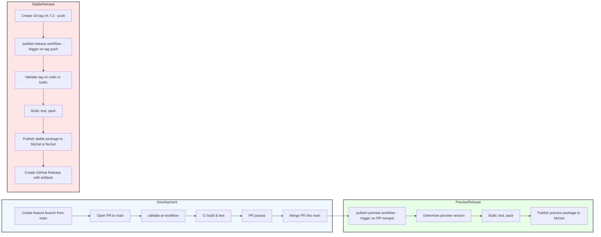

# CI/CD Workflow Documentation

## Index

- [Overview](#overview)
- [Branching Model & Release Process](#branching-model--release-process)
- [1️⃣ Validate PR – `validate‑pr.yml`](#1️⃣-validate-pr--validateprymll)
- [2️⃣ Publish Preview – `publish‑preview.yml`](#2️⃣-publish-preview--publishpreviewymll)
- [3️⃣ Publish Release – `publish‑release.yml`](#3️⃣-publish-release--publishreleaseymll)
- [Summary Flow](#summary-flow)

## Overview

This repository follows a **trunk‑based development** model with `main` as the stable branch. All new work starts from `main` in a short‑lived feature branch, goes through a Pull Request (PR) validation pipeline, and is merged back into `main`. The CI system automatically creates **preview packages** for every merged PR and **stable releases** when a version tag is pushed.

The workflow is driven by three GitHub Actions:

1. **Validate PR** – runs on every PR opened or updated to ensure the code builds and tests successfully.
2. **Publish Preview** – triggered when a PR is merged into `main`; it builds a preview NuGet package and pushes it to [MyGet](https://www.myget.org/feed/Packages/maestrianet).
3. **Publish Release** – triggered by a tag push (e.g., `v1.2.3`); it validates the tag location, builds the stable package, publishes to [MyGet](https://www.myget.org/feed/Packages/maestrianet) and NuGet, and creates a GitHub Release.

Below each section describes the purpose, trigger conditions, and key steps of these workflows.

---

## Branching Model & Release Process

- **`main`** – the stable branch that always contains production‑ready code.
- **Feature branches** – created from `main` for a single feature or bug‑fix. They are short‑lived and merged back via a PR.
- **Preview version** – generated automatically when a PR is merged. The version format is `<major>.<minor>.<patch>-preview.pr-<PR‑number>` (e.g., `2.1.2-preview.pr-61`). This package is pushed to MyGet for testing.
- **Stable release** – created by pushing a Git tag that matches `vX.Y.Z`. The tag can be created either through the GitHub UI (recommended) or locally and pushed. Two release paths exist:
  - **Standard release** – tag must point to the latest commit on `main`.
  - **Hotfix release** – tag may point to a commit on a `hotfix/*` branch.

The CI ensures that only correctly‑tagged commits are published as stable packages.

---

## 1️⃣ Validate PR – `validate‑pr.yml`

**Trigger**: `pull_request` events of type `opened` or `synchronize` on the `main` branch.

**Key steps**:
1. **Checkout code** – `actions/checkout@v5` (full history with default depth).
2. **Show branch & commit** – prints the current branch and commit SHA for debugging.
3. **Setup .NET** – `actions/setup-dotnet@v5` with .NET 10.0.
4. **Display .NET version** – `dotnet --version`.
5. **Build** – `dotnet build --configuration Release`.
6. **Test** – `dotnet test --configuration Release --no-build`.

The workflow guarantees that any code entering `main` passes compilation and unit tests, providing an early gate before preview or release pipelines run.

---

## 2️⃣ Publish Preview – `publish‑preview.yml`

**Trigger**: `pull_request` **closed** events where the PR was **merged** into `main` (filter on `branches: - main`).

**Purpose**: Build a preview NuGet package for the just‑merged PR and publish it to MyGet.

**Key steps**:
1. **Checkout** – full history (`fetch-depth: 0`).
2. **Show git information** – prints current branch, commit hash, and latest tag.
3. **Determine preview version**:
   - Retrieves the latest tag (`v*`).
   - Extracts `MAJOR.MINOR.PATCH`, increments the patch, and appends `-preview.pr-<PR‑number>`.
   - Stores the version in `GITHUB_ENV` and `GITHUB_OUTPUT`.
4. **Abort if version could not be determined** – fails the run if the version string is empty.
5. **Setup .NET** – .NET 10.0.
6. **Display .NET version**.
7. **Build & Test** – `dotnet build` and `dotnet test` (Release configuration).
8. **Pack** – `dotnet pack` using `-p:Version=${{ env.PACKAGE_VERSION }}`.
9. **Upload artifact** – stores the generated `.nupkg` as a GitHub artifact.
10. **Publish to MyGet** – pushes the preview package to the MyGet feed using the `MYGET_API_KEY` secret.

The preview package enables downstream developers to test the upcoming changes before an official release.

---

## 3️⃣ Publish Release – `publish‑release.yml`

**Trigger**: `push` of a tag matching the pattern `v*.*.*` (e.g., `v1.2.3`).

**Purpose**: Validate the tag location, produce a stable NuGet package, publish it to MyGet and NuGet, and create a GitHub Release.

**Key steps**:
1. **Checkout** – full history (`fetch-depth: 0`).
2. **Show git information** – prints branch, commit hash, and the current tag.
3. **Validate tag position**:
   - Compares the tag commit (`GITHUB_SHA`) with the latest commit on `origin/main`.
   - If they match, validation passes.
   - Otherwise, looks for the commit on any `hotfix/*` branch. If found, validation passes as a hotfix release.
   - If neither condition is satisfied, the workflow aborts.
4. **Determine stable version** – removes the leading `v` from the tag name and stores it in `PACKAGE_VERSION`.
5. **Abort if version indeterminate** – fails the run if the version is empty.
6. **Setup .NET** – .NET 10.0.
7. **Display .NET version**.
8. **Build, Test, Pack** – same commands as the preview workflow but using the stable version.
9. **Upload artifact** – publishes the `.nupkg` to GitHub artifacts.
10. **Publish to MyGet** – pushes the stable package to the MyGet feed.
11. **Publish to NuGet** – pushes the same package to `nuget.org` using `NUGET_API_KEY`.
12. **Create GitHub Release** – uses `ncipollo/release-action@v1` to create a release with the tag, attach the package artifact, and generate release notes.

This workflow guarantees that only properly validated tags result in a public release, protecting downstream consumers from accidental or unauthorized publishing.

---

## Summary Flow

1. **Create feature branch** from `main`.
2. **Open PR** – `validate‑pr` ensures the changes compile and pass tests.
3. **Merge PR** – `publish‑preview` runs automatically, generating a preview package on MyGet.
4. **When ready for production** – create a tag `vX.Y.Z` (via GitHub UI or locally).
5. **Tag push** – triggers `publish‑release`, which validates the tag, builds the stable package, publishes to MyGet and NuGet, and creates a GitHub Release.

Developers can therefore rely on a fully automated, secure pipeline that enforces quality gates, provides early preview artifacts, and safely publishes stable releases.

---

*All steps rely on the `dotnet` SDK version **10.0**, the `MYGET_API_KEY` secret for MyGet publishing, and the `NUGET_API_KEY` secret for NuGet publishing.*
